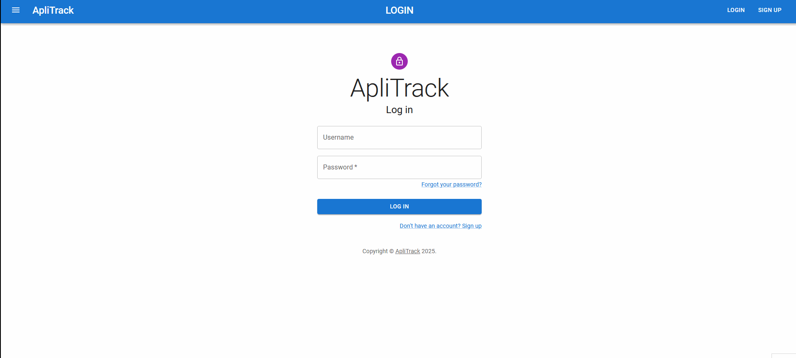
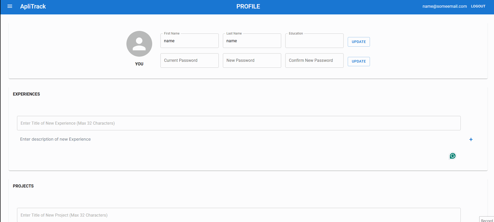
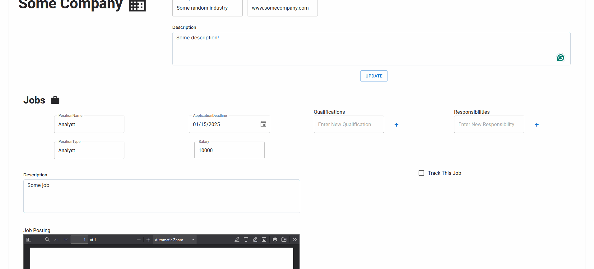
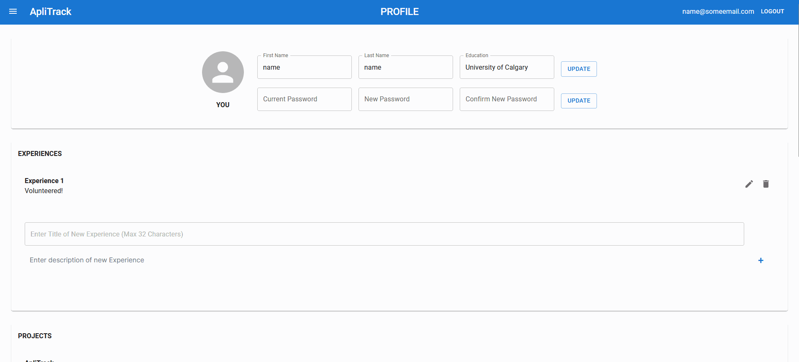

# ApliTrack
ApliTrack is a Job Application Tracking System (JATS) that aims to ease the burden of managing job applications for busy University students who find themselves applying to tens or hundreds of jobs, often due to limited professional experience and a highly competitive job market. With ApliTrack, applicants are able to manage the most relevant information pertaining
to their job applications in one comprehensive solution, keeping track of components like the applications themselves, the jobs and companies they apply to, the documents they submit, the interviews and offers they receive, as well as any of their contacts who may be relevant to the jobs they apply to.

To create ApliTrack, the group followed the database design and implementation process from start to finish. First, an initial proposal and set of broad requirements was created to establish the purpose and general functionality of the web application. Then, an enhanced entity relationship diagram with 13 entities (EERD) was created to convey all components of the application, more clearly illustrating the information that would be stored in the database and the resulting functionality that could be reasonably expected. Once the EERD was complete, it was mapped to a relational model (RM) that more closely resembled the underlying database structure that is used in the back-end of the application.

Note: This repository has been modified slightly so it can be presented publicly. This project was created with 2 other group members.

## Diagrams
Diagrams used to plan and document this project can be found under the Documentation folder in this repo. The diagrams include:
- Enhanced Entity Relationship Diagram
- Relational Model Diagram
- Use Case Diagram
- Sequence Diagram
Note: some of these diagrams are big so you may have to zoom in

## Running the application
1. download [node and npm](https://docs.npmjs.com/downloading-and-installing-node-js-and-npm)
2. Run the server
```
cd ApliTrack/server
npm install
npm run start:dev
```
3. Run the client (on a seperate terminal)
```
cd ApliTrack/client
npm install
npm run start:dev
```

> [!WARNING] 
> Note: you may have to run these commands instead if npm install shows errors
> ```
> npm install @mui/material @emotion/react @emotion/styled --legacy-peer-deps
> npm install @mui/icons-material --legacy-peer-deps
> ```
When prompted with `Would you like to run the app on another port instead? › (Y/n)` type in `y`.


## Signup and login
Users will be warned if passwords do not match or if a user already exists with the provided username. Note that a welcome email is sent upon registration.



## Profile
Applicants can update personal information or their password by pressing the corresponding update button on the right. They can also add Experiences, Projects, Certifications, Skills, and Competitions by populating the corresponding empty fields in the Profile page. 



## Documents
This page allows applicants to upload documents, provide a document type and description, and upload the file itself. Applicants are also able to update each document by updating the necessary fields and then pressing the update button. A search option is avaliable looking up document file names or the type of document. Applicants can also enhance the search by specifying the sorting order in which to display results. Upon selecting the sorting method, the search icon on the right must be pressed to execute the search and show the results. To delete a document, applicants can press the bin icon.


## Companies and Jobs
Upon first loading the companies page, applicants will typically encounter previously populated company entries, as these are shared across all applicants. If the companies
page is blank, that means no applicants have yet added any companies to the system. The idea is that applicants can "work together" by adding companies and jobs to assist each other in the job search.

### Adding Company and Jobs
A new company can be added by filling in the fields, then pressing the create button to the right. Note that jobs can only be added to existing companies. If a company does not exist and an applicant wishes to add a job, they must add the company to the system first. Any fields for the company and job can then be edited and updated with the update buttons.


### Qualifications, Responsibilities and Tracking
With a job added, applicants have the option of adding multiple qualifications and responsibilities to the job. To add these, applicants can simply enter the new qualification and/or responsibility and press the corresponding + icon. Applicants can also track certain jobs by ticking the 'Track This Job' box on the screen. Once the job is being tracked, applicants can enter information specific to tracking, such as a target date to apply and any notes, and then press the Update button to save that information. 



### Searching Companies and Jobs
Applicants are able to search the companies page by company names and/or the application deadlines. Alternatively, we can display jobs that are being personally tracked by using the tracking filter. Note that if the tracking filter is selected, all companies will still be displayed (if there is no company search applied), but only tracked jobs will display under each company.


## Applications

Users can add, edit, or delete their own applications. For existing applications, applicants can add even more details by specifying categories for each application, relevant URLs, specific documents submitted for each application, and the job(s) that the application corresponds to. Categories and Relevant URLs are custom and can thus be entered into their fields as shown below. 


## Contacts
Upon first loading the Contacts page, applicants will typically encounter previously populated Contact entries, as these are shared across all applicants. Applicants can add or update contacts. Applicants can also specify which companies each contact works at using the 'works at' field. With many contacts in the system, applicants can further specify whether they personally know a particular contact by selecting the ‘I know this person!’ checkbox. Finally, applicants are also able to specify whether the contacts they know have provided any referrals, and if so, then for which existing job in the system.


## Interviews
An interview can be added by filling in the fields under ‘Add New Interview’, then pressing Create. Note that while Stage and Date take any input from the user, the Application field is a dropdown menu that displays the applicant’s existing applications in the system. 

Existing interviews can then be supplemented with additional information, like any Contacts who are stored in the system who are attending the interview, as well as the specific jobs that the interview is related to. These can be selected in their corresponding dropdown menus that display entries that already exist in the application. Once added, attending contacts and mentioned jobs appear. Note that each can be hovered over to display the full text.

Note that if duplicate items are attempted to be added by the applicant, they will see an error pop up informing them of this.



## Offers
An offer can be added by filling in the fields to the right of Create Offer. Note that the Job field is a dropdown that only allows for selection of jobs already in the system. Additionally, applicants are able to upload their job offer files to the system using the rightmost field. If applicants have multiple offers to decide between, they are able to easily search and compare offers by using the various search options provided, including searching by lowest and highest compensation, earliest and latest response deadline, and earliest and latest start date.


## Users (Admin)
Upon loading the user page (which admins can only access) the admins will be able to see a list of users that currently exist on the system/database. From here they are able to update user’s first and last names, activate and deactivate their accounts, change their permission levels and reset their passwords. They can even create or delete users from the database. Admins also have the option to search for users using their first or last names.

## Logged Out Views (Contacts and Companies)
Finally, users who are not logged in are able to view the Contacts and Companies pages, as these entries are public and not specific to any particular applicants. However, since the users are not logged in, they are unable to make any additions or updates to the data in the system, as these actions require users to be logged in.

## Mobile and Tablet Views
Since our group spends considerable time on mobile or tablet devices, we had an incentive to make our application compatible with both mobile and tablet screen sizes. 

# Features (Languages/Technologies Used: TypeScript, React.js, Node.js, Express, SQLite, Sequelize, Pug.js)
- Uses a REST API with an MVC backend architecture that supports filtering, sorting, PROPER authentication with JWT (token must be valid, not expired, the user's password has not changed, and the user is not inactive) and authorization
- Has **INCREDIBLY** strong error handling with a generic "catch all" error handler that reduces code duplication and distinguishes between different types of errors
- Deals with unhandled rejections and exceptions
- Supports creation of new users by storing encrypted passwords in database; allows user to change password and reset it if it is forgotten via Brevo email handling
- A proper data model derived from an Enhanced Entity Relationship Diagram which was then mapped to the Relational Model; the corresponding tables from the relational model were implemented in Sequelize using SQLite as the underlying DBMS.
- Factory functions reduce code duplication in controllers and views
- Email templating created Pug.js, with blocks used to reduce code duplication and HTML data sets used to transfer data. A snackbar is shown whenever there is ANY error, so the user is never left surprised as to what is happening. A success snackbar is shown to give feedback when an operation is successful.
- Custom file uploading using Multer, with file names and paths stored in the database; the actual file is kept on the file system, and a special suffix is added to ensure we can distnguish between two files that otherwise have the same name.
&nbsp;

# Limitations/Design Choices
- The backend has lots of code reuse and little duplication, however, the frontend has considerable duplication. The team was focused on completing the project before the deadline and decided to "jump in" to frontend development without planning beforehand. In the future, we would plan out the frontend design BEFORE we start coding. It may take a few extra hours upfront, but it would considerably speed up development time. 
- TypeScript was used albeit sparingly; some group members were not familiar with TypeScript, so explicit annotations were not used to prevent confusion. **TypeScript was used _only_ for type inference (which still helped us catch tons of errors).**
- The EERD models admins and applicants as being disjoint; however, the current system implementation allows admins to perform all actions allowed by applicants, therefore modeling them as overlapping. This change was made to simplify the backend while maintaining the desired functionality.
- Sequelize was unable to correctly process and implement foreign keys that reference composite primary keys. This proved to be an issue only for weak entities that were previously defined with composite keys and which were then referenced by other relations in the database. To address this, weak entities that were affected by the issue were instead given a new primary key in the form of a unique auto-assigned and incremented integer ID, enabling them to have a single primary key that can be referenced. However, to ensure that the original functionality was preserved, attributes that previously comprised the composite key were assigned unique tags, ensuring that the combination of these attributes is unique for any instance in the relation, thereby mimicking the functionality of a composite primary key. This change was applied to the following entities in the database: `Interview`, `Document`, `Application`, `Job`
- The developer table was deemed redundant because a developer’s and admin's permissions and abilities are normally managed in the GitHub repository, NOT in the application itself. This table was not created in the final application.
- Some rest API routes are created in the backend (and fully functional), but have no corresponding frontend. Specifically, the routes relating to `AdminResponsibility` (which was deemed redundant as `PermissionLevel` could easily capture this info), `DeveloperType`, `Specialization`, and Admin `Abilities` (which is instead determined by the routes to which the admin has access, NOT the database itself).
- Additional columns not present in the EERD or the Relational Model may be seen in the application; some of these are to deal with Sequelize constraints regarding referencing composite primary keys. Others are to aid with functionality from our Use Case diagram that was not originally conceived during the EERD phase. For example, the user has `PasswordLastChangedAt`, `PasswordResetToken`, and `PasswordResetExpires` columns (to help with authentication and password changing, forgetting, and resetting functionality in the application).
- Initially, the group settled on using MySQL, but swapped to SQLite because connection to MySQL and synchronization (not to mention preventing race conditions) proved to be difficult.
